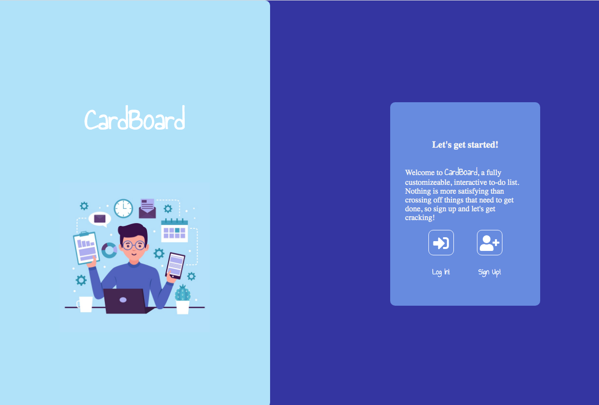
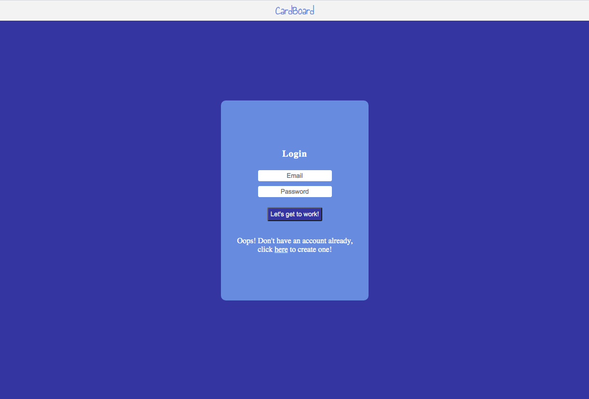
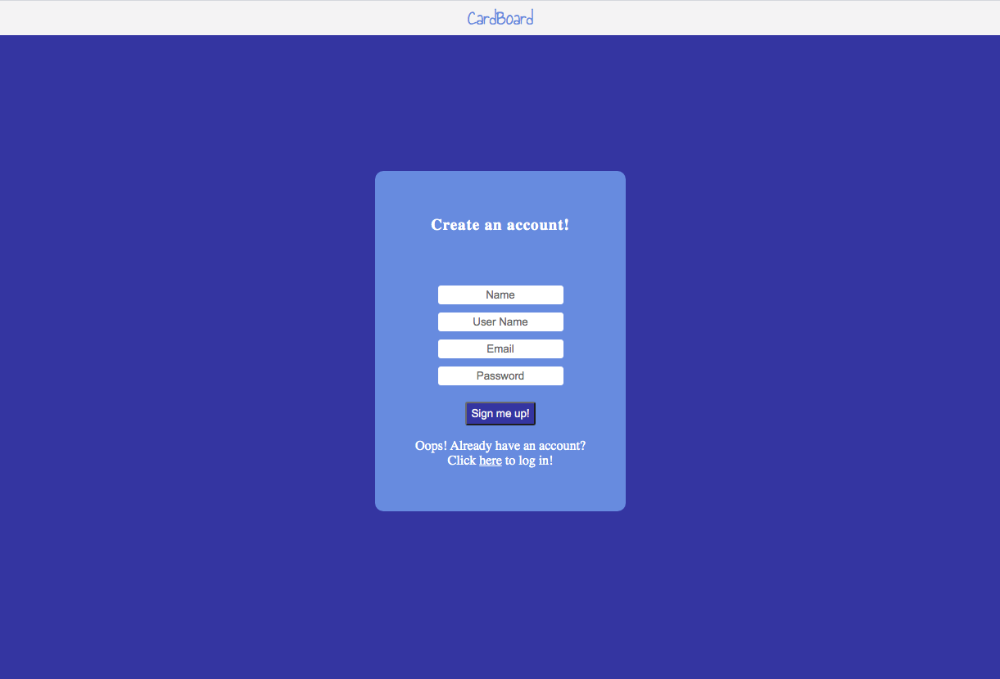
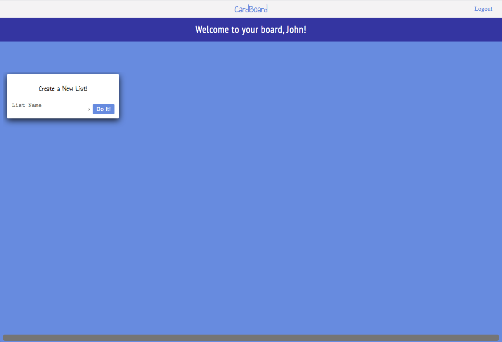
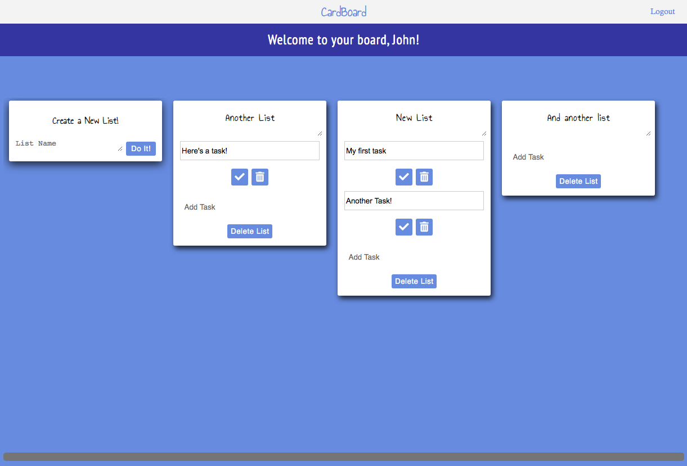
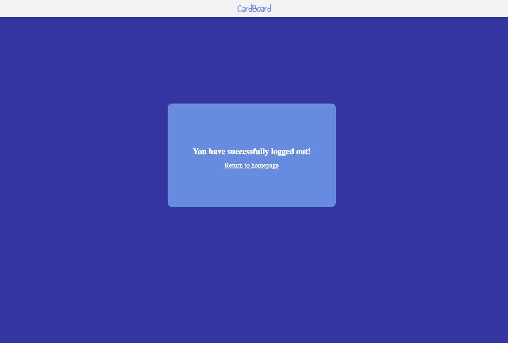

# CardBoard
___

Welcome to CardBoard! CardBoard is a fully interactive, digital to-do list. In other words, this is an attempted clone of Trello, without all of the cool features that Trello provides! CardBoard is the result of my final project for General Assembly's Software Engineering Immersive program. 

___

### Why?

I wanted to make an app that I can see myself improving and even using over time. I wanted to take a model, Trello, that has a lot of UX/UI properties and see if I could test myself in building something interactive using Express and EJS. I was also encouraged to use Express/EJS only for this project in order to implement drag and drop components later.

___

### User Abilities

I wanted to give CardBoard users a robust experience, being able to create an intuitive online to-do list that was fully customizable. The goal was to have a user be able to create an account and instantly be able to update their board. The user has the ability to create any number of lists, and be able to populate those lists with a number of tasks. Along the way, if the user needs to edit a list name or task, they have to option to. Furthermore, if the user finishes a task, or the list as a whole, there is a delete task and delete list option. Other features that are planned, but still need to be developed, are allowing the user to move their lists and tasks via drag and drop, and to make lists collaborative with other users.

### Technologies Used

Express.js, Node.js, Sequelize, Postgres, EJS, HTML5, CSS, Javascript
___

### Screenshots

___

### Future Development

* Drag and Drop Feature
* Allow User to create multiple boards and navigate them
* Include collaborative boards, where the board owner can invite other users
* Allowing user to choose avatar/profile
* Allow user to choose different background images or colors
* Archive feature for lists and tasks
* Change username feature
* Strikethrough finished tasks with checkmark button

___

### Special Thanks

This project would not have happened without the help of a lot of great people. There are so many to name, but a few special mentions go out to Brock Whitbread-Cole, Jacob Kleiman, James Sinkler, and Michael Petty - all are fantastic instructors and helped me through many blockers. A huge thanks to my fellow GA students who kept me sane during this project and offering support and advice along the way. Lastly, the internet for doing what it does and also Trello for making a product worthy enough to replicate.
